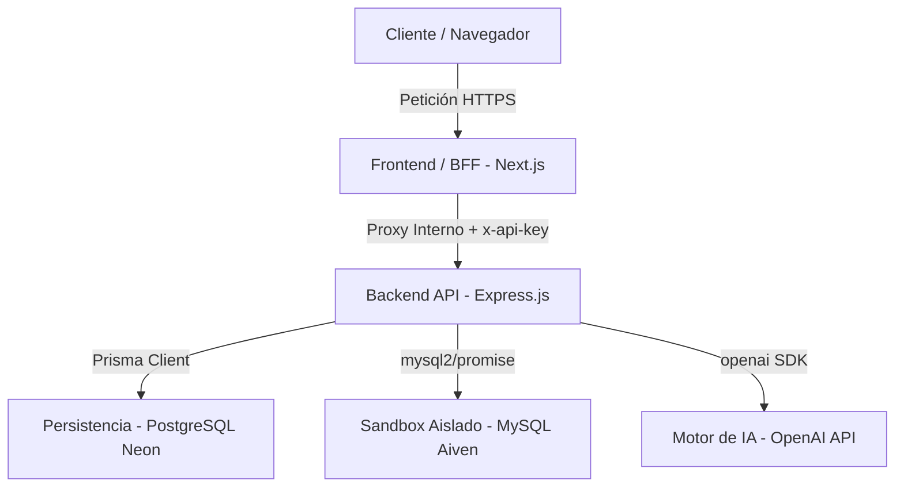
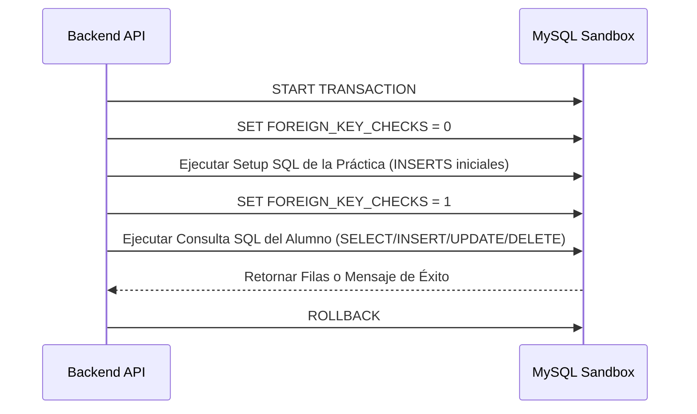

# Arquitectura de Software, Stack Tecnológico y Seguridad

Este documento describe formalmente la arquitectura orientada a servicios (SOA) de la plataforma **Q-LIT (Query Laboratory Interactive Tool)**, justificando la selección de tecnologías y detallando los controles de seguridad implementados a nivel de infraestructura, aplicación y base de datos.

---

## 1. Stack Tecnológico y Justificación Técnica

Q-LIT está diseñado bajo un modelo desacoplado de dos capas principales (Frontend y Backend) para garantizar alta cohesión y bajo acoplamiento.

### 1.1. Capa de Frontend (Next.js 14+ - App Router)
* **React 18**: Permite el desarrollo de una interfaz de usuario reactiva, modular y de alto rendimiento. Esto es fundamental para actualizar dinámicamente el editor de código, el diccionario de entidades y la retroalimentación en tiempo real sin recargar la página.
* **Tailwind CSS (v4)**: Se utiliza Tailwind CSS para agilizar el diseño de la interfaz de usuario mediante clases de utilidad modernas y optimizadas, garantizando un diseño responsivo, modular y consistente en toda la aplicación.
* **NextAuth.js (v4)**: Solución estándar de la industria para la gestión de sesiones mediante inicio de sesión social con Google OAuth 2.0. Protege la identidad en el navegador utilizando cookies seguras cifradas de solo lectura HTTP (`__Secure-next-auth.session-token`).

### 1.2. Capa de Backend (Express.js)
* **Node.js con Express.js**: Proporciona un entorno de ejecución rápido y asíncrono, ideal para manejar de forma concurrente múltiples peticiones REST provenientes de los estudiantes en los laboratorios escolares.
* **Prisma ORM (v5.22.0)**: ORM de tipado estricto que mapea con precisión los modelos en la base de datos PostgreSQL, facilitando las transacciones complejas, la migración de esquemas y asegurando consultas eficientes libres de inyección de código SQL al utilizar consultas parametrizadas internamente.
* **openai**: SDK oficial de OpenAI utilizado para instanciar el cliente del modelo `gpt-4o-mini`, que realiza la evaluación lógica del código SQL de los alumnos de manera ágil y con soporte estricto de esquemas estructurados de respuesta.

### 1.3. Motores de Base de Datos y Almacenamiento
* **PostgreSQL (Neon Cloud)**: Es la base de datos relacional principal para la persistencia del negocio. Almacena las clases, usuarios, entregas de prácticas, checklist de evaluación y los registros históricos de errores. Se eligió PostgreSQL por su compatibilidad nativa con funciones y procedimientos almacenados transaccionales avanzados y su excelente escalabilidad.
* **MySQL (Aiven Cloud)**: Motor relacional que actúa como el **SQL Sandbox (simulador)**. Los estudiantes ejecutan sus consultas en esta base de datos MySQL aislada, asegurando que practiquen sobre la sintaxis DML (INSERT, UPDATE, DELETE) y DQL (SELECT) estándar de este motor sin alterar la base de datos administrativa del sistema.

---

## 2. Modelo de Seguridad y Patrón BFF (Backend-For-Frontend)

Para evitar exponer directamente la dirección del servidor backend en la nube a los navegadores del cliente, resolver problemas de origen cruzado (CORS) y blindar la autenticidad de las peticiones, se implementó el patrón **BFF (Backend-For-Frontend)**:

1. **Proxy Interceptor**: El Frontend Next.js expone una ruta interceptora en [route.js](file:///c:/Users/yasbe/OneDrive/Escritorio/Q-LIT/next-app-js/src/app/api/proxy/[...path]/route.js).
2. **Validación del Token JWT**: Cuando el cliente realiza una petición a `/api/proxy/*`, el BFF intercepta la petición, extrae el token de sesión de la cookie cifrada en el servidor de Next.js y verifica su autenticidad utilizando el secreto local (`NEXTAUTH_SECRET`).
3. **Firma e Inyección de Cabeceras**: Si el JWT es válido y la sesión existe, el BFF firma la petición que se redirigirá al backend usando una clave secreta compartida (`API_SECRET_KEY`) en el encabezado `x-api-key`. Además, inyecta directamente la información del usuario obtenida del token:
   * `x-user-id`: ID de base de datos del usuario autenticado.
   * `x-user-role`: Rol verificado (`student` o `teacher`).
4. **Validación en el Servidor Express**: El backend API de Express utiliza un middleware centralizado (`bffAuthMiddleware`) que valida exclusivamente la cabecera `x-api-key` contra su variable de entorno `API_SECRET_KEY`. Al coincidir, confía plenamente en las cabeceras `x-user-id` y `x-user-role` inyectadas de forma segura por el proxy del frontend.

> [!IMPORTANT]
> El servidor Express backend está configurado en la nube para rechazar cualquier petición directa que no contenga el encabezado `x-api-key` autorizado, anulando posibles ataques de bypass del proxy.

---

## 3. Seguridad a Nivel de Aplicación (Backend Protections)

### 3.1. Helmet.js (Cabeceras de Seguridad)
El backend cuenta con **Helmet** para mitigar ataques web comunes inyectando cabeceras HTTP restrictivas:
* `X-Frame-Options: SAMEORIGIN`: Previene ataques de clickjacking.
* `X-Content-Type-Options: nosniff`: Evita que el navegador interprete archivos con tipos MIME incorrectos.
* `X-DNS-Prefetch-Control`: Desactiva la pre-búsqueda DNS para proteger la privacidad del usuario.
* Ocultación de cabeceras de servidor que puedan revelar que el servidor corre sobre Node.js/Express (`X-Powered-By`).

### 3.2. Rate Limiting (Límites de Consumo)
Para proteger el sistema contra ataques de Denegación de Servicio (DoS) y el consumo excesivo de la API de OpenAI, se implementaron dos limitadores con `express-rate-limit`:
1. **Limitador General**: Aplica un límite de **1000 solicitudes cada 15 minutos** por usuario. Se calcula basándose en el encabezado `x-user-id` enviado por el BFF (con fallback a la IP si el usuario no se ha autenticado), permitiendo un uso intensivo pero seguro dentro de las redes compartidas de los laboratorios universitarios.
2. **Limitador de Evaluaciones**: Configura un máximo de **150 peticiones por hora** en los endpoints `/api/evaluations/step` y `/api/evaluations`. Esto previene ciclos infinitos en el editor y el abuso deliberado de tokens de IA.

---

## 4. SQL Sandbox: Aislamiento y Simulación de Consultas

Una de las características más críticas de Q-LIT es permitir a los alumnos ejecutar código SQL libre sin comprometer los datos de prueba de otros usuarios o del catálogo común. Esto se logra mediante un mecanismo de aislamiento transaccional estricto en la conexión de MySQL:

1. **Inicio de Transacción**: Al recibir una consulta SQL del estudiante, el backend abre una conexión dedicada con la base de datos MySQL sandbox y ejecuta un `START TRANSACTION`.
2. **Inyección de Datos de la Práctica (Setup SQL)**: 
   * Se desactivan temporalmente las restricciones de llaves foráneas (`SET FOREIGN_KEY_CHECKS = 0`) para garantizar la inyección limpia del setup de registros iniciales generados aleatoriamente por la IA para el alumno.
   * Se ejecutan las sentencias `INSERT INTO` del script `setupSql` correspondiente a la entrega del alumno.
   * Se reactivan las restricciones de llaves foráneas (`SET FOREIGN_KEY_CHECKS = 1`).
3. **Ejecución del Estudiante**: Se corre la consulta SQL enviada por el alumno dentro de la misma transacción.
4. **Reversión Total (Rollback)**: Al finalizar la consulta, y sin importar si la consulta del estudiante fue de consulta (`SELECT`) o de modificación (`INSERT`, `UPDATE`, `DELETE`), el backend ejecuta de forma obligatoria un `ROLLBACK`.
5. **Resultado**: La base de datos MySQL sandbox revierte instantáneamente todas las inserciones del setup y los cambios realizados por el estudiante. El sandbox permanece inmutable en el servidor, listo para la siguiente petición.

### 4.1. Bloqueo Preventivo de DDL
Antes de enviar la consulta al motor MySQL, el backend valida sintácticamente el string mediante expresiones regulares para rechazar de inmediato palabras clave de Lenguaje de Definición de Datos (DDL) como `CREATE`, `ALTER`, `DROP`, `RENAME`, o de control como `GRANT` y `REVOKE`, arrojando un error amigable al alumno y protegiendo el esquema de la base de datos de pruebas.
