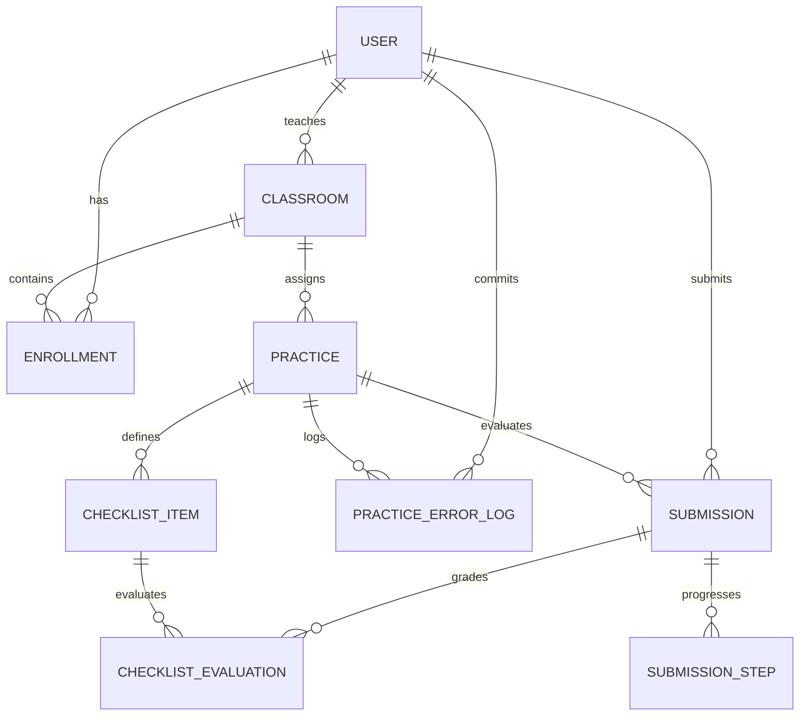

# Estructura de Base de Datos y Requerimientos Avanzados (SQL)

Este documento detalla el modelado físico de datos de **Q-LIT** implementado mediante Prisma ORM en PostgreSQL, así como la justificación técnica del cumplimiento de los requerimientos de programación y administración en base de datos avanzadas solicitados en la rúbrica del proyecto escolar.

---

## 1. Mapeo del Esquema Físico (Prisma Models)

La base de datos administrativa principal está implementada en **PostgreSQL** y se gestiona mediante **Prisma ORM**. Los modelos se definen en el archivo [schema.prisma](file:///c:/Users/yasbe/OneDrive/Escritorio/Q-LIT/backend-api/prisma/schema.prisma) de la siguiente manera:



* **`User`**: Almacena información de perfil de los usuarios autenticados vía Google (nombre, email, imagen) y su rol en la plataforma (`student` o `teacher`).
* **`Classroom`**: Representa las aulas o laboratorios creados por un docente. Contiene un código de invitación único y un marcador lógico `isArchived`.
* **`Enrollment`**: Tabla de ruptura que asocia un estudiante con un aula específica, controlando si el acceso está activo.
* **`Practice`**: Almacena la estructura general de una práctica (título, descripción, palabras clave SQL obligatorias en formato JSON, fecha límite y puntaje).
* **`ChecklistItem`**: Criterios de evaluación atómicos generados al crear la práctica.
* **`Submission`**: Controla el estado global de la entrega de un estudiante para una práctica, registrando la fecha de entrega, el código SQL final, la retroalimentación y la calificación manual del docente.
* **`ChecklistEvaluation`**: Tabla relacional que indica si un intento cumple o no (`aiComplies` / `teacherComplies`) con cada criterio del `ChecklistItem`.
* **`SubmissionStep`**: Controla el progreso paso a paso del alumno para superar los 3 a 4 objetivos lógicos planteados de forma secuencial, almacenando los códigos exitosos intermedios y un historial JSON de errores cometidos por paso.
* **`PracticeErrorLog`**: Almacena de forma histórica y desglosada cada error sintáctico o semántico cometido por los estudiantes en la consola, clasificados por categoría (ej. "Error de Sintaxis", "Tabla inexistente") y cláusula SQL (ej. "JOIN", "WHERE"). Es utilizado para alimentar el análisis de Temas Críticos del docente.

---

## 2. Programación en la Base de Datos (SQL Avanzado)

A continuación, se documenta la creación y el consumo de los objetos de base de datos relacionales requeridos por la rúbrica del proyecto integrador.

### 2.1. Consultas usando variantes de JOIN
En nuestro backend de Express, las consultas de estadísticas e historial requieren la combinación de múltiples tablas relacionales:

1. **Consulta 1 (Join de Expediente de Calificaciones)**:
   Une la tabla de entregas (`Submission`) con el usuario (`User`) y la práctica (`Practice`) para construir la vista de calificaciones del maestro.
   ```sql
   SELECT s.id, u.name AS student_name, p.title AS practice_title, s.final_grade 
   FROM "Submission" s
   INNER JOIN "User" u ON s.user_id = u.id
   INNER JOIN "Practice" p ON s.practice_id = p.id;
   ```
2. **Consulta 2 (Join de Inscripción al Laboratorio)**:
   Une la tabla de inscripciones (`Enrollment`) con el perfil del estudiante (`User`) y el aula (`Classroom`) para listar las personas participantes en el feed de la clase.
   ```sql
   SELECT e.id, u.name AS student_name, c.name AS classroom_name, e.joined_at 
   FROM "Enrollment" e
   INNER JOIN "User" u ON e.user_id = u.id
   INNER JOIN "Classroom" c ON e.classroom_id = c.id
   WHERE e.is_archived = FALSE;
   ```

---

### 2.2. Vistas (VIEWS)
Creamos dos vistas físicas en PostgreSQL para optimizar los reportes analíticos del backend y evitar sobrecargar al ORM con consultas anidadas pesadas:

1. **Vista de Calificaciones Consolidadas (`v_student_grades`)**:
   Consolida el rendimiento de los alumnos agrupando laboratorios y estatus de revisión.
   ```sql
   CREATE OR REPLACE VIEW v_student_grades AS
   SELECT 
       u.id AS student_id,
       u.name AS student_name,
       u.email AS student_email,
       p.id AS practice_id,
       p.title AS practice_title,
       c.name AS classroom_name,
       s.final_grade AS final_grade,
       s.review_status AS status
   FROM "User" u
   INNER JOIN "Submission" s ON u.id = s.user_id
   INNER JOIN "Practice" p ON s.practice_id = p.id
   INNER JOIN "Classroom" c ON p.classroom_id = c.id;
   ```
   *Consumo desde la APP*: Se ejecuta mediante consultas crudas optimizadas en Prisma:
   ```javascript
   const grades = await prisma.$queryRawUnsafe('SELECT * FROM v_student_grades WHERE student_id = $1', studentId);
   ```

2. **Vista de Estadísticas de Laboratorios (`v_classroom_stats`)**:
   Obtiene métricas de inscritos, total de entregas y promedios grupales por aula.
   ```sql
   CREATE OR REPLACE VIEW v_classroom_stats AS
   SELECT 
       c.id AS classroom_id,
       c.name AS classroom_name,
       c.group AS classroom_group,
       COUNT(DISTINCT e.user_id) AS enrolled_students,
       COUNT(DISTINCT s.id) AS total_submissions,
       COALESCE(AVG(s.final_grade), 0) AS average_grade
   FROM "Classroom" c
   LEFT JOIN "Enrollment" e ON c.id = e.classroom_id AND e.is_archived = FALSE
   LEFT JOIN "Practice" p ON c.id = p.classroom_id
   LEFT JOIN "Submission" s ON p.id = s.practice_id AND s.review_status = 'calificada'
   GROUP BY c.id, c.name, c.group;
   ```
   *Consumo desde la APP*: Utilizado en el panel de analíticas del docente:
   ```javascript
   const stats = await prisma.$queryRaw`SELECT * FROM v_classroom_stats`;
   ```

---

### 2.3. Índices de Base de Datos
Para acelerar los filtros, ordenamiento de información y agregaciones del dashboard, configuramos índices de búsqueda en PostgreSQL a través del archivo `schema.prisma`:

1. **Índices en Classroom**:
   Optimiza la búsqueda de clases por docente y su estatus de archivado.
   ```sql
   CREATE INDEX "Classroom_teacherId_idx" ON "Classroom"("teacherId");
   CREATE INDEX "Classroom_isArchived_idx" ON "Classroom"("isArchived");
   ```
2. **Índices en logs de errores (`PracticeErrorLog`)**:
   Acelera drásticamente el agrupamiento estadístico de fallas SQL por práctica y usuario (Temas Críticos).
   ```sql
   CREATE INDEX "PracticeErrorLog_userId_idx" ON "PracticeErrorLog"("userId");
   CREATE INDEX "PracticeErrorLog_practiceId_idx" ON "PracticeErrorLog"("practiceId");
   ```

---

### 2.4. Funciones Almacenadas (STORED FUNCTIONS)
Implementamos dos funciones a nivel físico en la base de datos PostgreSQL para realizar cálculos atómicos rápidos:

1. **Promedio de Estudiante (`fn_get_student_average`)**:
   Devuelve la calificación promedio general obtenida por un alumno en todas sus prácticas entregadas.
   ```sql
   CREATE OR REPLACE FUNCTION fn_get_student_average(student_uuid VARCHAR)
   RETURNS NUMERIC AS $$
   DECLARE
       avg_grade NUMERIC;
   BEGIN
       SELECT COALESCE(AVG(final_grade), 0) INTO avg_grade
       FROM "Submission"
       WHERE user_id = student_uuid AND review_status = 'calificada';
       RETURN avg_grade;
   END;
   $$ LANGUAGE plpgsql;
   ```
   *Consumo*:
   ```javascript
   const [res] = await prisma.$queryRaw`SELECT fn_get_student_average(${studentId}) AS average`;
   ```

2. **Total de Errores del Alumno (`fn_get_error_count`)**:
   Retorna la suma acumulada de errores de compilación registrados para un estudiante.
   ```sql
   CREATE OR REPLACE FUNCTION fn_get_error_count(student_uuid VARCHAR)
   RETURNS INTEGER AS $$
   DECLARE
       error_count INTEGER;
   BEGIN
       SELECT COUNT(*) INTO error_count
       FROM "PracticeErrorLog"
       WHERE user_id = student_uuid;
       RETURN error_count;
   END;
   $$ LANGUAGE plpgsql;
   ```
   *Consumo*:
   ```javascript
   const [res] = await prisma.$queryRaw`SELECT fn_get_error_count(${studentId}) AS errorCount`;
   ```

---

### 2.5. Procedimientos Almacenados (STORED PROCEDURES)
Para ejecutar procesos transaccionales masivos y operaciones de mantenimiento, creamos dos procedimientos almacenados:

1. **Archivado Masivo de Aulas (`sp_archive_classroom`)**:
   Realiza una actualización transaccional para archivar el aula y, en cascada, desactivar todas las inscripciones asociadas a ella.
   ```sql
   CREATE OR REPLACE PROCEDURE sp_archive_classroom(classroom_uuid VARCHAR)
   LANGUAGE plpgsql
   AS $$
   BEGIN
       -- Archivar el aula
       UPDATE "Classroom" 
       SET is_archived = TRUE 
       WHERE id = classroom_uuid;
       
       -- Archivar las inscripciones de los alumnos asociados
       UPDATE "Enrollment" 
       SET is_archived = TRUE 
       WHERE classroom_id = classroom_uuid;
   END;
   $$;
   ```
   *Consumo*: Invocado al eliminar un laboratorio desde el panel de control del docente:
   ```javascript
   await prisma.$queryRaw`CALL sp_archive_classroom(${classroomId})`;
   ```

2. **Mantenimiento y Purga de Logs (`sp_clean_old_error_logs`)**:
   Elimina del servidor los registros de logs de errores SQL de los estudiantes que tengan una antigüedad superior a N días, evitando el crecimiento excesivo de espacio en el disco.
   ```sql
   CREATE OR REPLACE PROCEDURE sp_clean_old_error_logs(days_old INTEGER)
   LANGUAGE plpgsql
   AS $$
   BEGIN
       DELETE FROM "PracticeErrorLog"
       WHERE created_at < NOW() - INTERVAL '1 day' * days_old;
   END;
   $$;
   ```
   *Consumo*: Ejecutado por tareas cron automáticas en el servidor:
   ```javascript
   await prisma.$queryRaw`CALL sp_clean_old_error_logs(30)`;
   ```

---

## 3. Administración y Seguridad de la Base de Datos

### 3.1. Conexión Restringida (No Root)
El backend de Q-LIT no realiza conexiones a los motores relacionales utilizando credenciales del superusuario administrador (`root` en MySQL o el superusuario del sistema). En su lugar:
* Se conecta a PostgreSQL mediante un usuario propietario de base de datos específico (`avnadmin` o el usuario asignado por Neon) que tiene sus permisos restringidos a los esquemas de tablas utilizados por la aplicación.
* Se conecta a MySQL Sandbox con credenciales específicas de desarrollo, evitando el acceso a base de datos del sistema u otros esquemas.

### 3.2. Roles Físicos de Base de Datos y Privilegios
Para proteger las tablas administrativas y académicas directamente en el motor de base de datos PostgreSQL, se configuraron dos roles con privilegios estrictos aplicando el principio de menor privilegio:

```sql
-- 1. Creación física de los roles en PostgreSQL
CREATE ROLE rol_docente;
CREATE ROLE rol_alumno;

-- 2. Asignación de privilegios al rol docente (Gestión académica)
GRANT SELECT, INSERT, UPDATE, DELETE ON "Classroom", "Practice", "ChecklistItem", "ChecklistEvaluation", "Submission" TO rol_docente;

-- 3. Asignación de privilegios al rol alumno (Lectura limitada y registro de progreso)
GRANT SELECT ON "Classroom", "Practice" TO rol_alumno;
GRANT SELECT, INSERT, UPDATE ON "Submission", "SubmissionStep", "PracticeErrorLog" TO rol_alumno;
```
* Estos roles aíslan el acceso físico a los datos, garantizando que el perfil de estudiante no pueda alterar esquemas de evaluación ni modificar entregas de otros alumnos de forma directa.
